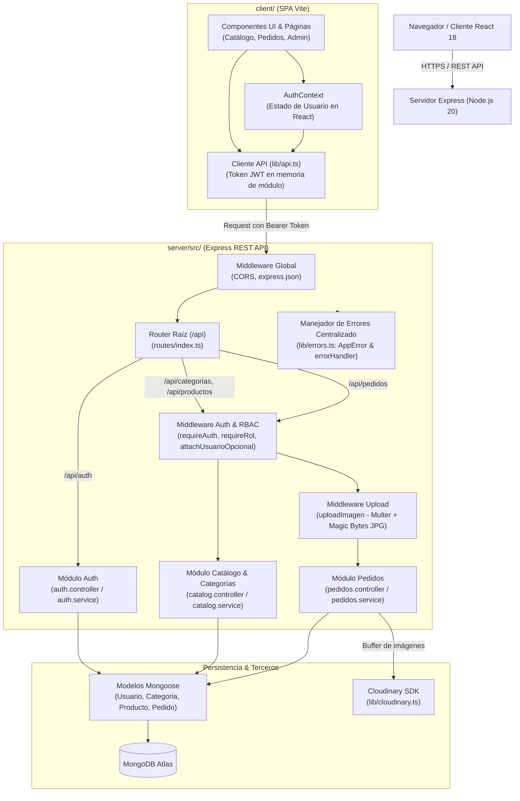
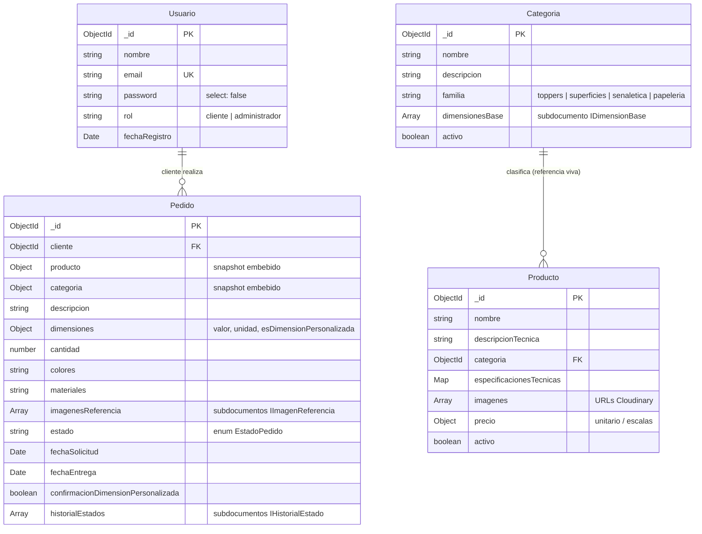

# Architecture

## Status

Active. Este documento refleja la arquitectura implementada en el repositorio actual para `taju.platform`. El comportamiento de producción se valida contra las variables de entorno configuradas y los servicios desplegados (MongoDB Atlas, Cloudinary).

---

## Institutional Context & Purpose

**taju.platform** es la plataforma web MERN para **TaJú**, taller de corte y grabado láser ubicado en Neiva (Huila) especializado en papelería creativa y objetos personalizados para celebraciones y eventos.

Cumple con 2 necesidades operativas principales:

1. **Catálogo y Recepción de Pedidos Personalizados (Cliente Final y Profesional)**: Permite a los clientes explorar productos organizados en 4 familias canónicas (`toppers`, `superficies`, `senaletica`, `papeleria`), configurar dimensiones base o personalizadas, especificar materiales/colores, adjuntar referencias visuales (JPG) y enviar solicitudes de pedido con cálculo de precios unitarios o por escalas de volumen.
2. **Gestión de Taller y Control de Producción (Administrador)**: Panel operativo con tono neutro que gestiona el ciclo de vida de los pedidos mediante una máquina de estados lineal finita, confirmación obligatoria de dimensiones no estándar, asignación de fechas de entrega, gestión del catálogo/categorías y visualización de carga de trabajo.

El proyecto se enmarca dentro del Proyecto Integrador II (PI-II), implementando integridad histórica estricta (requisito DA05) mediante snapshots de datos embebidos al momento de registrar pedidos.

---

## Tech Stack Overview

| Layer | Technology | Version | Purpose / Notes |
|---|---|---|---|
| Frontend Framework | React | 18.3.1 | SPA basada en componentes funcionales y hooks |
| Bundler & Dev Server | Vite | 5.4.2 | Bundler rápido para el cliente SPA |
| Client Routing | React Router DOM | 6.26.1 | Enrutamiento del cliente con protección de rutas (`ProtectedRoute`) |
| Backend Framework | Express.js | 4.19.2 | API REST modular bajo Node.js |
| Language | TypeScript | 5.5.4 | Tipado estricto unificado en `client` y `server` |
| Styling System | Tailwind CSS + CSS Tokens | 3.4.10 | Tokens semánticos (`tokens.css`) consumidos vía variables CSS en `tailwind.config.js` |
| ODM | Mongoose | 8.5.3 | Modelado y validación de esquemas en MongoDB |
| Database | MongoDB Atlas | Cloud | Base de datos NoSQL de documentos |
| Password Hashing | bcryptjs | 2.4.3 | Hasheo de contraseñas en registro y verificación en login |
| Auth JWT | jsonwebtoken | 9.0.2 | Emisión y verificación de tokens firmados (expiración 8h) |
| Client Auth Storage | Memoria JavaScript | Nativo | Token en memoria del módulo (`api.ts`), sin `localStorage` ni cookies |
| File Upload Middleware | Multer | 2.0.2 | Procesamiento en memoria (`memoryStorage`) de imágenes JPG (máx. 3 archivos, 5 MB) |
| Cloud Asset Storage | Cloudinary | 2.4.0 | Almacenamiento seguro de imágenes de referencia (`taju/pedidos`) |
| Schema Validation | Zod + Type Guards | 3.23.8 | Validación de tipos y contratos en runtime |
| Monorepo Manager | pnpm workspaces | >=9.0.0 | Gestión de workspaces (`client`, `server`) con dependencias fijas |
| Linter & Formatter | ESLint + Prettier | 9.9.1 / 3.3.3 | Flat config con `typescript-eslint` |

---

## High-Level Architecture

---

## Layer Details

### 1. Middleware (`server/src/middleware/`)

Ejecuta validaciones transversales antes de invocar la lógica de negocio en los controladores:

1. **`auth.ts`**:
   - `requireAuth`: Exige la presencia del header `Authorization: Bearer <token>`. Decodifica y valida el payload mediante `verifyToken()`. Inyecta el usuario decodificado en `req.usuario`. Responde `401 Unauthorized` si el token es nulo, inválido o expirado.
   - `attachUsuarioOpcional`: Inspecciona el header `Authorization` de forma no bloqueante. Si el token es válido, puebla `req.usuario` (usado para que administradores vean productos/categorías inactivas en consultas públicas sin forzar autenticación a clientes anónimos).
2. **`rbac.ts`**:
   - `requireRol(...roles: Rol[])`: Middleware factory de autorización por rol (`cliente` | `administrador`). Verifica que `req.usuario.rol` pertenezca al conjunto admitido; responde `403 Forbidden` en caso contrario.
3. **`upload.ts`**:
   - `uploadImagen`: Maneja carga multipart mediante Multer en memoria (`memoryStorage`). Limita hasta 3 archivos de máximo 5 MB cada uno. Ejecuta doble validación: inspección de MIME-type declarado (`image/jpeg`) e inspección estricta de los primeros 3 bytes de firma binaria (`0xFF 0xD8 0xFF`), bloqueando payloads falsificados.
4. **`lib/errors.ts`**:
   - `asyncHandler`: Envoltorio para handlers asíncronos de Express 4 que redirige excepciones no capturadas al middleware final.
   - `errorHandler`: Captura instancias de `AppError` retornando el código HTTP explícito y mensaje amigable; cualquier otra excepción no controlada se registra en log y responde `500 Internal Server Error`.

### 2. Route Handlers / Controllers (`server/src/modules/` y `server/src/routes/`)

La API organiza sus rutas bajo el prefijo `/api`:

- **Módulo Auth** (`/api/auth`):
  - `POST /registrar`: Registro de nuevos clientes con hash bcrypt y emisión de JWT.
  - `POST /login`: Autenticación por email/password y retorno de JWT + datos de usuario.
  - `GET /me`: Consulta del perfil autenticado (`requireAuth`).
- **Módulo Catálogo y Categorías** (`/api/categorias` y `/api/productos`):
  - `GET /api/categorias`: Listado de categorías activas (o todas si es administrador).
  - `GET /api/categorias/:id`: Detalle de categoría.
  - `POST /api/categorias`, `PATCH /api/categorias/:id`: Creación y modificación de categorías (`requireRol('administrador')`).
  - `GET /api/productos`: Catálogo público filtrable por query param `?familia=...` (los administradores ven productos inactivos).
  - `GET /api/productos/:id`: Detalle de producto con categoría poblada.
  - `POST /api/productos`, `PATCH /api/productos/:id`, `DELETE /api/productos/:id`: CRUD administrativo de productos (`requireRol('administrador')`).
- **Módulo Pedidos** (`/api/pedidos`):
  - `POST /`: Creación de pedido (`requireAuth` + `uploadImagen`).
  - `GET /mis-pedidos`: Historial de pedidos del cliente autenticado (`requireAuth`).
  - `GET /:id`: Consulta individual de pedido asegurando aislamiento por `clienteId` o acceso de administrador.
  - `GET /`: Listado completo de pedidos para el taller (`requireRol('administrador')`).
  - `PATCH /:id/estado`: Transición controlada en la máquina de estados (`requireRol('administrador')`).
  - `PATCH /:id/fecha-entrega`: Asignación de fecha estimada de entrega (`requireRol('administrador')`).
- **Healthcheck**:
  - `GET /health`: Endpoint liviano sin autenticación para monitoreo y verificación de despliegue.

**[DECISION]** Los pedidos persisten snapshots embebidos (`producto` y `categoria`) en lugar de referencias vivas. Esto garantiza el cumplimiento del requisito DA05 (integridad histórica): si una categoría o producto se renombra, desactiva o elimina posteriormente, los pedidos existentes preservan intactas las especificaciones exactas bajo las cuales fueron contratados.

### 3. Business Logic Layer (`server/src/modules/*/service.ts`)

La lógica de negocio reside estrictamente en los servicios desacoplados de los controladores:

| Servicio | Responsabilidades Principales |
|---|---|
| `auth.service.ts` | Normalización de email, verificación de no duplicidad, hasheo con bcrypt, comparación de hashes y firma de tokens JWT. |
| `catalog.service.ts` | Filtrado por familia y visibilidad (`activo`), validación de unicidad, borrado lógico/físico de productos y actualización de dimensiones base. |
| `pedidos.service.ts` | Validación de existencia y estado activo de producto/categoría, subida paralela a Cloudinary, persistencia de snapshots embebidos, verificación de transiciones de estado secuenciales, control de aprobación de dimensiones personalizadas y registro atómico de auditoría en `historialEstados`. |

### 4. Data Access Layer & Persistence (`server/src/models/`)

Acceso a datos a través de esquemas Mongoose fuertemente tipados:

| Modelo | Archivo | Responsabilidad / Particularidades |
|---|---|---|
| `Usuario` | `models/Usuario.ts` | Usuarios del sistema (`cliente` / `administrador`). `password` tiene `select: false` e indexación única sobre `email`. `toJSON` elimina el hash para prevenir fugas accidentales. |
| `Categoria` | `models/Categoria.ts` | Familias canónicas (`toppers`, `superficies`, `senaletica`, `papeleria`), estado `activo` para soft-delete e índice compuesto `{ familia: 1, activo: 1 }`. |
| `Producto` | `models/Producto.ts` | Catálogo de productos con referencia a `Categoria`, especificaciones técnicas libres (Map) y esquema dual de precios (unitario o escalas por volumen). |
| `Pedido` | `models/Pedido.ts` | Documento central con snapshots embebidos (`ICategoriaEmbebida`, `IProductoEmbebido`), subdocumentos de dimensiones y recursos adjuntos, máquina de estados e historial de auditoría inmutable. |

### 5. Database Layer (MongoDB Atlas + Mongoose)

- **Políticas de Eliminación**: Desactivación lógica (`activo: false`) en categorías y productos para preservar la integridad referencial.
- **Índices de Alto Rendimiento**:
  - `Usuario`: `{ email: 1 }` (único).
  - `Categoria`: `{ familia: 1, activo: 1 }`.
  - `Producto`: `{ categoria: 1, activo: 1 }`.
  - `Pedido`: `{ cliente: 1, estado: 1 }`, `{ estado: 1, fechaSolicitud: -1 }`, `{ 'dimensiones.esDimensionPersonalizada': 1 }`.

### 6. Client Layer & Hooks (`client/src/`)

- **`AuthContext.tsx`**: Provee el estado global de autenticación (`usuario`, `autenticado`), exponiendo `login`, `registrar` y `logout`.
- **`lib/api.ts`**: Cliente HTTP wrapper sobre `fetch` que administra el token en memoria (`_token`), inyecta cabeceras `Authorization: Bearer <token>` y gestiona serialización JSON y `FormData`.
- **`components/shared/ProtectedRoute.tsx`**: Enrutador de protección que valida sesión activa y rol de usuario, redirigiendo a `/login` o a la ruta designada por `RUTA_INICIO_POR_ROL`.
- **`hooks/useCatalogo.ts`**: Hook de consulta del catálogo con cancelación de peticiones desfasadas (`cleanup flag`) y filtrado por familia.
- **`lib/precio.ts`**: Lógica de cálculo de precios del lado cliente, soportando productos de precio unitario directo y productos con escalas por volumen (familia `superficies`, mínimo 12 unidades).
- **Mapeos de Presentación Centralizados (`types/index.ts`)**: `ETIQUETAS_ESTADO`, `ETIQUETAS_FAMILIA` y `CLASES_ESTADO`, garantizando que ninguna etiqueta o color de estado se declare de forma literal en componentes.

---

## Security Architecture

### In-Memory JWT Authentication

El sistema implementa autenticación JWT sin persistencia en almacenamiento web (`localStorage` o `sessionStorage`) ni cookies:

| Contexto | Implementación | Módulo |
|---|---|---|
| Emisión y Verificación Backend | `jsonwebtoken` (HMAC SHA-256) | `server/src/lib/jwt.ts` |
| Almacenamiento Cliente | Variable en memoria del módulo (`_token`) | `client/src/lib/api.ts` |
| Manejo de Estado en UI | React Context (`AuthProvider`) | `client/src/contexts/AuthContext.tsx` |

- **Ventaja de Seguridad**: Neutraliza el robo persistente de tokens frente a ataques XSS. Si la pestaña se cierra o recarga, el token se descarta inmediatamente por diseño.
- **Mitigación CSRF**: Al enviarse explícitamente mediante encabezados `Authorization: Bearer <token>` en lugar de cookies implícitas del navegador, los endpoints quedan inherentemente protegidos contra ataques Cross-Site Request Forgery estándar.

### RBAC (Role-Based Access Control)

El sistema define 2 roles canónicos: `cliente` y `administrador`.

- **En Backend**: Evaluado mediante `requireAuth` + `requireRol('administrador')`.
- **En Frontend**: Enrutamiento protegido vía `ProtectedRoute` con redirección contextual:
  - Clientes intentando acceder a `/admin/*` son redirigidos a `/mis-pedidos`.
  - Administradores en rutas no privilegiadas son orientados a `/admin/pedidos`.

### File Upload Hardening

La subida de archivos en `server/src/middleware/upload.ts` implementa defensa en profundidad:

1. Límite de tamaño: 5 MB por archivo, máximo 3 archivos por petición.
2. Almacenamiento en memoria: No se crean archivos temporales en el disco del servidor.
3. Validación de cabecera MIME: Filtra peticiones que no declaren `image/jpeg`.
4. Inspección binaria de magic bytes: Verifica que el buffer inicie con la secuencia real de JPEG (`0xFF 0xD8 0xFF`), impidiendo la carga de ejecutables o scripts disfrazados.
5. Transmisión directa a Cloudinary: Carga mediante data URI base64 en la carpeta aislada `taju/pedidos`.

---

## Deployment & CI/CD Pipeline

- **Target Platforms**:
  - Servidor: Node.js 20 LTS (ej. Render, Railway o VPS).
  - Cliente: SPA estática servida vía CDN (ej. Vercel, Netlify o Cloudflare Pages).
  - Base de Datos: MongoDB Atlas Cluster.
  - Medios: Cloudinary Media Storage.
- **CI Workflow** (`.github/workflows/ci.yml`):
  El flujo de integración continua se dispara en pushes y PRs hacia las ramas `main` y `dev`, ejecutando dos jobs independientes:
  1. **Job `client`**:
     - `pnpm install --frozen-lockfile`
     - `pnpm --filter taju-client lint`
     - `pnpm --filter taju-client typecheck`
     - `pnpm --filter taju-client build`
  2. **Job `server`**:
     - `pnpm install --frozen-lockfile`
     - `pnpm --filter taju-server lint`
     - `pnpm --filter taju-server typecheck`

### Supply Chain Security

- **Pnpm Workspaces**: Configuración con `allowBuilds` estricto en `pnpm-workspace.yaml`.
- **Dependencias Exactas**: Todas las dependencias en `package.json`, `client/package.json` y `server/package.json` están fijadas con versiones exactas (sin comodines `^` o `~`).
- **Instalaciones Deterministas**: Uso obligatorio de `--frozen-lockfile` en entornos CI para evitar desincronizaciones silenciosas del árbol de paquetes.

---

## Known Limitations & Technical Debt

| Área | Asunto | Impacto | Mitigación / Estado |
|---|---|---|---|
| Auth Client | Sesión volátil en memoria | Al recargar la página (`F5`), el usuario pierde la sesión activa y debe volver a ingresar sus credenciales | Decisión de diseño asumida para seguridad de taller; mitigada por flujo rápido de login y token de 8h |
| CORS | Configuración permisiva en dev | `cors()` sin restricción de origen en `server/src/app.ts` durante etapas de desarrollo | Aceptado temporalmente; parametrizar con `CLIENT_ORIGIN` en variables de entorno al fijar dominio de producción |
| Catálogo | Miniatura por orden de arreglo | La primera imagen del arreglo `imagenes[0]` actúa como portada del producto | Mitigado por convención operativa de carga; evaluar selector explícito de imagen principal a futuro |
| Testing Suite | Sin E2E ni cobertura mínima exigida | Vitest cubre unidades e integración (server con mongodb-memory-server, client con jsdom + Testing Library) y corre en CI; no hay pruebas de navegador real | Definir umbral de cobertura y evaluar E2E cuando el flujo de pedidos se estabilice |
| Pedidos | Imágenes huérfanas ante duplicados simultáneos | `crearPedido` sube a Cloudinary antes de la transacción; si dos envíos idénticos llegan a la vez, el perdedor recibe 409 pero sus imágenes ya quedaron subidas | Aceptado: el chequeo previo de la clave corta los reintentos secuenciales; limpieza de huérfanos pendiente |

---

## Verification Command Checklist

Antes de commitear cambios arquitectónicos o de código:

1. `pnpm lint` — Valida reglas de estilo y buenas prácticas ESLint en cliente y servidor.
2. `pnpm typecheck` — Ejecuta `tsc --noEmit` garantizando ausencia de errores de tipos en TypeScript.
3. `pnpm build:client` — Compila y empaqueta el frontend con Vite asegurando un build de producción limpio.
4. `pnpm --filter taju-server build` — Compila el backend de TypeScript a JavaScript en `server/dist/`.
